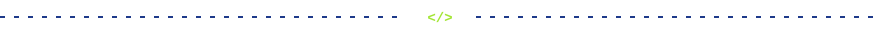
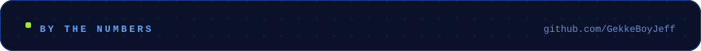

 

&nbsp;
&nbsp;

 

  
    Repos ↗&nbsp;
    <a href="https://github.com/GekkeBoyJeff/TechGirlssss/wiki/Jeffrey-%F0%9F%8E%AE">Cr8 write-up</a> ·
    <a href="https://github.com/GekkeBoyJeff/barebone-chat-app">Chat app</a> ·
    <a href="https://github.com/GekkeBoyJeff/Barcode-scanner">Barcode scanner</a> ·
    <a href="https://www.jeffreyullers.nl">Portfolio</a>
  

 

 

 

 

**More of what I build lives at jeffreyullers.nl.**

 

Jeffrey Ullers · <code>@justjeffvibes</code> · Zaandam, NL 
 

